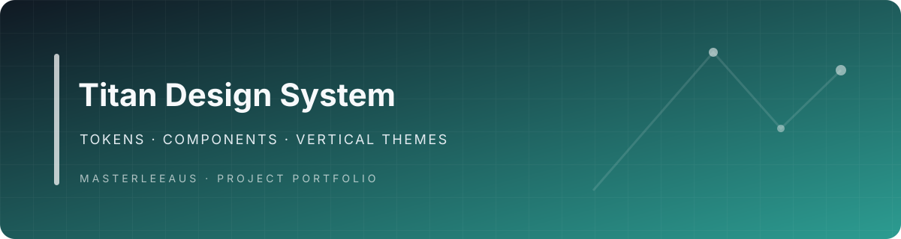

<div align="center">

# Titan Design System

**A layered design-system foundation for Titan Zero field and home-service experiences.**

</div>

> **Status: source foundation and reference manifests.** The repository contains a platform theme manifest, design tokens, component contracts, surface components, vertical overlay manifests, and validation scripts. It is not a standalone application or a released theme marketplace package.

## Architecture

Titan Themes separates two layers:

1. **Platform themes** — shared Titan Zero shell, tokens, components, surfaces, and experience variants.
2. **Vertical overlays** — industry terminology, workflows, forms, checklists, widgets, and AI actions layered over the platform.

The current source includes the Titan Zero Core manifest and starter vertical manifests for cleaning, electrical, HVAC, landscaping, painting, pest control, plumbing, and property maintenance. These are reference overlays; validate their field-level completeness and integration with the active application before treating any as production-ready.

## Repository map

- `themes/titan-zero-core/` — core theme manifest, tokens, component contracts, and surface components
- `verticals/` — versioned industry overlay manifests
- `tests/` — foundation and architecture validation scripts
- `docs/` — implementation plans and architecture notes
- `releases/titan-themes-source.zip` — packaged source snapshot

## Validate

Run the source validation scripts with Python 3:

```bash
python tests/validate-foundation.py
python tests/validate-architecture.py
```

The repository defines these checks; this README update did not execute them. Successful validation confirms structural invariants, not visual accessibility or integration with the live Titan Zero app.

## Development provenance

The README previously referred to `feature/titan-theme-foundation` as the active branch. Confirm current branch/release state before using that as workflow guidance; the default-branch content and validation files are the source inspected here.

## Relationship to Titan Zero

Titan Themes is a supporting design-system project for [Titan Zero Field Service Workforce](https://github.com/Masterleeaus/Titan-Zero-Field-Service-Workforce). Platform shell ownership remains with the host application. Vertical overlays may contribute content through the declared component slots but must not replace the host's security, tenancy, or authority boundaries.

## License and distribution

Review the repository's license and release metadata before redistributing the source archive. Do not claim marketplace compatibility until package format, versioning, installation, rollback, and host compatibility are verified.

## Banner

A checked-in project-specific banner is displayed above.

